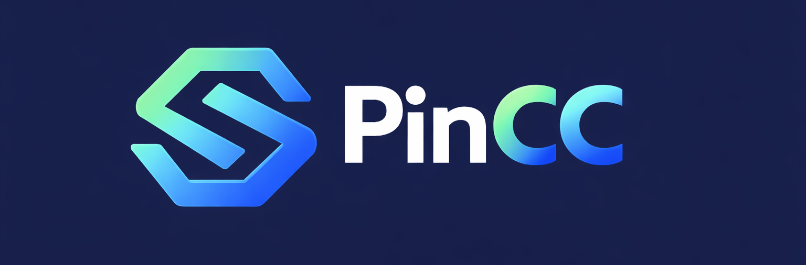
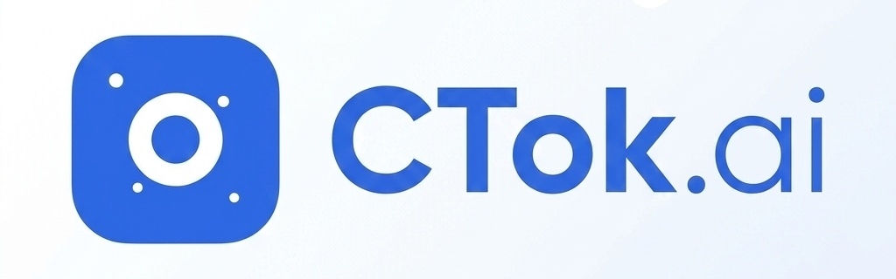
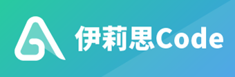
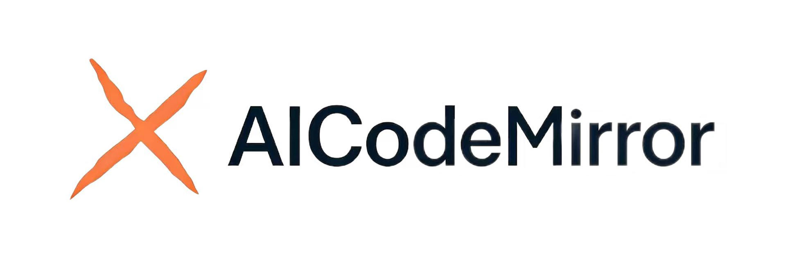
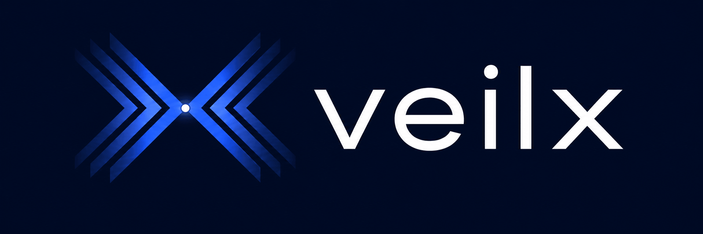

# AySub

<div align="center">

[](https://golang.org/)
[](https://vuejs.org/)
[](https://www.postgresql.org/)
[](https://redis.io/)
[](https://www.docker.com/)

**Three-in-one AI API gateway based on Sub2API, NewAPI, and Grok2API**

English | [中文](README_CN.md) | [日本語](README_JA.md)

</div>

> **AySub is a modified integration fork based on Sub2API.** The Go module and some legacy systemd/helper paths currently still use the upstream `sub2api` identifier for compatibility. Docker images, services, containers, networks, and volumes use the AySub naming by default.

---

## Project Status

AySub is currently implemented in `/Volumes/llovky/AitchTey/code/AySub`. The main gateway, NewAPI-style business operations, xAI/Grok official API Key support, Grok Cookie reverse adapter, console model adapter, and local generated-media cache have been merged into the current codebase.

There is no dedicated public AySub demo in this repository yet. Self-hosted deployments should create their own admin account during setup or through the configured `ADMIN_EMAIL` / `ADMIN_PASSWORD`.

## Overview

AySub is an AI API gateway platform that keeps the Sub2API scheduling core and adds NewAPI-style commercial operations plus a Go implementation of Grok2API reverse access. Users call upstream AI services through platform-generated API Keys, while AySub handles authentication, account scheduling, model pricing, billing, quota control, media generation routing, and request forwarding.

## Features

- **Sub2API Scheduling Core** - Account pool scheduling, sticky sessions, circuit breaking, concurrency limits, rate limits, and token-level usage records.
- **NewAPI-style Operations** - User balance, platform quota, groups, API key permissions, orders, recharge plans, payment instances, payment callbacks, and payment dashboard.
- **Model and Pricing Management** - Default model pricing, channel model allowlists, model sync candidates, per-channel pricing UI, token/image/request billing modes, and user-facing available-channel pricing display.
- **Multi-Provider Gateway** - OpenAI-compatible, Claude/Anthropic-compatible, Gemini-compatible, Antigravity, OpenAI OAuth/API Key, Claude OAuth/API Key, Gemini OAuth/API Key, and custom upstream channels.
- **xAI Official API Key** - xAI platform support with Chat Completions, Responses fallback, Anthropic Messages fallback, model listing, quota attribution, and channel monitoring.
- **Grok Cookie Reverse Adapter** - Grok Web Cookie accounts support Chat Completions, Responses, Anthropic Messages, search references, thinking streams, multimodal image upload, image generation/edit, video generation, and quota lookup.
- **Grok Console Models** - Supports `console.x.ai/v1/responses` routing for `grok-4.3-console`, `grok-4.3-low/medium/high`, `grok-4.20-*`, `grok-4.20-multi-agent-*`, and `grok-build-console` models through Chat, Responses, and Messages entries.
- **Generated Media Cache** - Generated Grok images/videos can be saved under `DATA_DIR/files/images` and `DATA_DIR/files/videos`, then served through `/v1/files/image` and `/v1/files/video`.
- **Built-in Payment System** - Supports EasyPay, Alipay, WeChat Pay, Stripe, and related self-service recharge flows without a separate payment deployment ([Configuration Guide](docs/PAYMENT.md)).
- **Admin Dashboard** - Web interface for users, accounts, channels, pricing, groups, payment, usage, monitoring, data management, and system settings.
- **External System Integration** - Embed external systems such as ticketing through iframe entries in the admin dashboard.

## Integration Notes

| Area | Current state |
|------|---------------|
| Sub2API core | Main scheduling, account pool, sticky session, billing records, rate limit, and gateway routes are retained. |
| NewAPI model/pricing | Main path is available: model pricing, channel allowlists, pricing sync, available channels, and admin channel pricing. A full standalone NewAPI-style “model marketplace” product page is not yet a separate finished module. |
| NewAPI business operations | Users, balance, quotas, groups, orders, recharge plans, payment instances, callbacks, and payment dashboard are present. Real merchant configuration still needs production validation. |
| Grok2API parity | Chat, Responses, Messages, Images, Videos, quota, model list, LiveKit token, LiveKit RTC proxy, console models, and local media cache are implemented in Go. Media link/upscale, Masonry/ChatKit/Admin WebUI, WARP, and FlareSolverr stacks are not directly imported. |
| End-to-end validation | Unit tests and frontend type checks have passed for the implemented paths. Real xAI/Grok Cookie/Console/media/LiveKit account validation is still required before production claims. |

## Upstream Sub2API Sponsors

This section is retained from the upstream Sub2API README for attribution and ecosystem context.

<table>
<tr>
<td width="180" align="center" valign="middle"><a href="https://shop.pincc.ai/"></a></td>
<td valign="middle"><b><a href="https://shop.pincc.ai/">PinCC</a></b> is the official relay service built on Sub2API, offering stable access to Claude Code, Codex, Gemini and other popular models — ready to use, no deployment or maintenance required.</td>
</tr>

<tr>
<td width="180"><a href="https://www.packyapi.com/register?aff=sub2api"></a></td>
<td>Thanks to PackyCode for sponsoring this project! PackyCode is a reliable and efficient API relay service provider, offering relay services for Claude Code, Codex, Gemini, and more. PackyCode provides special discounts for our software users: register using <a href="https://www.packyapi.com/register?aff=sub2api">this link</a> and enter the "sub2api" promo code during first recharge to get 10% off.</td>
</tr>

<tr>
<td width="180"><a href="https://ctok.ai"></a></td>
<td>Thanks to CTok.ai for sponsoring this project! CTok.ai is dedicated to building a one-stop AI programming tool service platform. We offer professional Claude Code packages and technical community services, with support for Google Gemini and OpenAI Codex. Through carefully designed plans and a professional tech community, we provide developers with reliable service guarantees and continuous technical support, making AI-assisted programming a true productivity tool. Click <a href="https://ctok.ai">here</a> to register!</td>
</tr>

<tr>
<td width="180"><a href="https://aigocode.com/invite/SUB2API"></a></td>
<td>Thanks to AIGoCode for sponsoring this project! AIGoCode is an all-in-one platform that integrates Claude Code, Codex, and the latest Gemini models, providing you with stable, efficient, and highly cost-effective AI coding services. The platform offers flexible subscription plans, zero risk of account suspension, direct access with no VPN required, and lightning-fast responses. AIGoCode has prepared a special benefit for sub2api users: if you register via <a href="https://aigocode.com/invite/SUB2API">this link</a>, you'll receive an extra 10% bonus credit on your first top-up!</td>
</tr>

<tr>
<td width="180"><a href="https://apikey.fun/register?aff=SUB2API"></a></td>
<td>Thanks to APIKEY.FUN for sponsoring this project! <a href="https://apikey.fun/register?aff=SUB2API">APIKEY.FUN</a> is one of the core contributors to the sub2api open-source project, dedicated to providing open, stable, and cost-effective AI API access. The platform supports API relay services for Claude, OpenAI, Gemini, and other popular models, with pricing starting from as low as 7% of the original rate. Register via the exclusive link: <a href="https://apikey.fun/register?aff=SUB2API">APIKEY</a> to enjoy a permanent 5% discount on all recharges.</td>
</tr>

<tr>
<td width="180"><a href="https://code.silkapi.com/register?aff=SUB2API"></a></td>
<td>Thanks to SilkAPI for sponsoring this project! <a href="https://code.silkapi.com/register?aff=SUB2API">SilkAPI</a> is a relay service built on Sub2API, specializing in providing high-speed and stable Codex API relay.</td>
</tr>

<tr>
<td width="180"><a href="https://ylscode.com/"></a></td>
<td>Thanks to YLS Code for sponsoring this project! <a href="https://ylscode.com/">YLS Code</a> is dedicated to building secure enterprise-grade Coding Agent productivity services, offering stable and fast Codex / Claude / Gemini subscription services along with pay-as-you-go API options for flexible choices. Register now for a limited-time 3-day Codex trial bonus!</td>
</tr>

<tr>
<td width="180"><a href="https://www.aicodemirror.com/register?invitecode=KMVZQM"></a></td>
<td>Thanks to AICodeMirror for sponsoring this project! AICodeMirror provides official high-stability relay services for Claude Code / Codex / Gemini CLI, with enterprise-grade concurrency, fast invoicing, and 24/7 dedicated technical support. Claude Code / Codex / Gemini official channels at 38% / 2% / 9% of original price, with extra discounts on top-ups! AICodeMirror offers special benefits for sub2api users: register via <a href="https://www.aicodemirror.com/register?invitecode=KMVZQM">this link</a> to enjoy 20% off your first top-up, and enterprise customers can get up to 25% off!</td>
</tr>

<tr>
<td width="180"><a href="https://shop.bmoplus.com/?utm_source=github"></a></td>
<td>Huge thanks to BmoPlus for sponsoring this project! BmoPlus is a highly reliable AI account provider built strictly for heavy AI users and developers. They offer rock-solid, ready-to-use accounts and official top-up services for ChatGPT Plus / ChatGPT Pro (Full Warranty) / Claude Pro / Super Grok / Gemini Pro. By registering and ordering through <a href="https://shop.bmoplus.com/?utm_source=github">BmoPlus - Premium AI Accounts & Top-ups</a>, users can unlock the mind-blowing rate of 10% of the official GPT subscription price (90% OFF)</td>
</tr>

<tr>
<td width="180"><a href="https://bestproxy.com/?keyword=a2e8iuol"></a></td>
<td>Thanks to Bestproxy for sponsoring this project! <a href="https://bestproxy.com/?keyword=a2e8iuol">Bestproxy</a> provides high-purity residential IPs with dedicated one-IP-per-account support. By combining real home networks with fingerprint isolation, it enables link environment isolation and reduces the probability of association-based risk control.</td>
</tr>

<tr>
<td width="180"><a href="https://pateway.ai/?ch=1tsfr51"></a></td>
<td>Thanks to PatewayAI for sponsoring this project! <a href="https://pateway.ai/?ch=1tsfr51">PatewayAI</a> is a premium API relay built for heavy AI developers, offering the full Claude and Codex series sourced 100% from official providers, with transparent token-level billing. Enterprise plans include high concurrency, dedicated management, contracts, and invoicing. Register now to get $3 in trial credits, top-ups from 60% off, and referral bonuses up to $150.</td>
</tr>

<tr>
<td width="180"><a href="https://api.pptoken.org/register?promo=SUB2API"></a></td>
<td>Thanks to PPToken.org for sponsoring this project! <a href="https://api.pptoken.org/register?promo=SUB2API">PPToken.org</a> specializes in GPT model API relay services, supporting Codex, Claude Code, OpenAI-compatible clients, and Gemini CLI integration. Top-ups are 1:1 (¥1 = $1 credit); GPT models start at 0.16x rate multiplier, with overall cost at roughly 2.2% of official pricing and first-token latency around 1 second — ideal for developers seeking low-cost, high-speed access to GPT model capabilities. Technical support: 24/7 real human responses (no bots), @tech in the group chat and get a reply within 10 minutes. Sponsor benefit: the first 200 users who register via the <a href="https://api.pptoken.org/register?promo=SUB2API">exclusive registration link</a> and enter promo code `SUB2API` can claim free Codex / Claude Code trial credits — no minimum spend, no card required.
</td>
</tr>

<tr>
<td width="180"><a href="https://runapi.co/register?aff=fu2E"></a></td>
<td>Thanks to RunAPI for sponsoring this project! <a href="https://runapi.co/register?aff=fu2E">RunAPI</a> is an efficient and stable API platform and OpenRouter alternative. With one API Key, you can access 150+ popular models including OpenAI, Claude, Gemini, DeepSeek, and Grok, with pricing as low as 10% of the original rate. It is highly stable and seamlessly compatible with tools such as Claude Code and OpenClaw.
</td>
</tr>

<tr>
<td width="180"><a href="https://unity2.ai/register?source=sub2api"></a></td>
<td>Thanks to Unity2 for sponsoring this project! <a href="https://unity2.ai/register?source=sub2api">Unity2</a> is a high-performance AI model API relay for individuals, teams, and enterprises, handling 30B+ tokens/day with 5000 RPM concurrency. One API Key works across Claude Code, Codex, OpenAI models, IDE plugins, and Agent workflows, with balance billing, bundled subscriptions, enterprise invoicing, and 1-on-1 support. <a href="https://unity2.ai/register?source=sub2api">Register</a> to claim $2 in balance, plus $10 more by joining the official group — up to $12 in free credit.
</td>
</tr>

<tr>
<td width="180"><a href="https://veilx.io/#/hello/SJRBRVDV"></a></td>
<td>Thanks to Veilx for sponsoring this project! <a href="https://veilx.io/#/hello/SJRBRVDV">Veilx</a> CDN is purpose-built for large-scale AI API traffic, deeply optimized for relay services and call chains across OpenAI, Claude, Gemini, and scenarios like chat, image generation, embeddings, and streaming — delivering lower latency and higher stability under heavy concurrency. It also offers China three-network optimized return lines, making it ideal for global AI relay platforms, overseas AI SaaS, and cross-border high-concurrency deployments.
</td>
</tr>

</table>

## Ecosystem

Upstream Sub2API community projects that are still relevant to AySub deployments:

| Project | Description | Features |
|---------|-------------|----------|
| ~~[Sub2ApiPay](https://github.com/touwaeriol/sub2apipay)~~ | ~~Self-service payment system~~ | **Now Built-in** — Payment is integrated into AySub/Sub2API, no separate deployment needed. See [Payment Configuration Guide](docs/PAYMENT.md) |
| [sub2api-mobile](https://github.com/ckken/sub2api-mobile) | Mobile admin console | Cross-platform app (iOS/Android/Web) for user management, account management, monitoring dashboard, and multi-backend switching; built with Expo + React Native |

## Tech Stack

| Component | Technology |
|-----------|------------|
| Backend | Go 1.25.7, Gin, Ent |
| Frontend | Vue 3.4+, Vite 5+, TailwindCSS |
| Database | PostgreSQL 15+ |
| Cache/Queue | Redis 7+ |

---

## Nginx Reverse Proxy Note

When using Nginx as a reverse proxy for AySub (or CRS) with Codex CLI, add the following to the `http` block in your Nginx configuration:

```nginx
underscores_in_headers on;
```

Nginx drops headers containing underscores by default (e.g. `session_id`), which breaks sticky session routing in multi-account setups.

---

## Deployment

### Method 1: Script Installation (Upstream Compatibility)

The one-click installer currently follows upstream Sub2API release artifacts. Use it only when you intentionally want the upstream-compatible binary layout. For the current AySub modified code, use Docker Compose or source build from this repository.

#### Prerequisites

- Linux server (amd64 or arm64)
- PostgreSQL 15+ (installed and running)
- Redis 7+ (installed and running)
- Root privileges

#### Installation Steps

```bash
curl -sSL https://raw.githubusercontent.com/Wei-Shaw/sub2api/main/deploy/install.sh | sudo bash
```

The script will:
1. Detect your system architecture
2. Download the latest release
3. Install binary to `/opt/sub2api`
4. Create systemd service
5. Configure system user and permissions

#### Post-Installation

```bash
# 1. Start the service
sudo systemctl start sub2api

# 2. Enable auto-start on boot
sudo systemctl enable sub2api

# 3. Open Setup Wizard in browser
# http://YOUR_SERVER_IP:8080
```

The Setup Wizard will guide you through:
- Database configuration
- Redis configuration
- Admin account creation

#### Upgrade

You can upgrade directly from the **Admin Dashboard** by clicking the **Check for Updates** button in the top-left corner.

The web interface will:
- Check for new versions automatically
- Download and apply updates with one click
- Support rollback if needed

#### Useful Commands

```bash
# Check status
sudo systemctl status sub2api

# View logs
sudo journalctl -u sub2api -f

# Restart service
sudo systemctl restart sub2api

# Uninstall
curl -sSL https://raw.githubusercontent.com/Wei-Shaw/sub2api/main/deploy/install.sh | sudo bash -s -- uninstall -y
```

---

### Method 2: Docker Compose (Recommended for AySub)

Deploy the current AySub source with Docker Compose, including PostgreSQL and Redis containers. The default compose files build the `aysub:latest` image from this repository.

#### Prerequisites

- Docker 20.10+
- Docker Compose v2+

#### Quick Start (One-Click Deployment)

Build the current repository image locally, then start the compose stack:

```bash
# Clone AySub
git clone https://github.com/AIAllABOUTYOU/AySub.git

# Prepare deployment config
cd AySub/deploy
cp .env.example .env
nano .env
mkdir -p data postgres_data redis_data

# Build and start services with local PostgreSQL and Redis
docker compose -f docker-compose.local.yml up -d --build

# View logs
docker compose -f docker-compose.local.yml logs -f aysub
```

Generate secure values for `JWT_SECRET`, `TOTP_ENCRYPTION_KEY`, and `POSTGRES_PASSWORD` before production use.

#### Manual Deployment

If you prefer manual setup:

```bash
# 1. Clone the repository
git clone https://github.com/AIAllABOUTYOU/AySub.git
cd AySub/deploy

# 2. Copy environment configuration
cp .env.example .env

# 3. Edit configuration (generate secure passwords)
nano .env
```

**Required configuration in `.env`:**

```bash
# PostgreSQL password (REQUIRED)
POSTGRES_PASSWORD=your_secure_password_here

# JWT Secret (RECOMMENDED - keeps users logged in after restart)
JWT_SECRET=your_jwt_secret_here

# TOTP Encryption Key (RECOMMENDED - preserves 2FA after restart)
TOTP_ENCRYPTION_KEY=your_totp_key_here

# Optional: Admin account
ADMIN_EMAIL=admin@example.com
ADMIN_PASSWORD=your_admin_password

# Optional: Custom port
SERVER_PORT=8080
```

**Generate secure secrets:**
```bash
# Generate JWT_SECRET
openssl rand -hex 32

# Generate TOTP_ENCRYPTION_KEY
openssl rand -hex 32

# Generate POSTGRES_PASSWORD
openssl rand -hex 32
```

```bash
# 4. Create data directories (for local version)
mkdir -p data postgres_data redis_data

# 5. Build and start all services
# Option A: Local directory version (recommended - easy migration)
docker compose -f docker-compose.local.yml up -d --build

# Option B: Named volumes version (simple setup)
docker compose up -d --build

# 6. Check status
docker compose -f docker-compose.local.yml ps

# 7. View logs
docker compose -f docker-compose.local.yml logs -f aysub
```

#### Deployment Versions

| Version | Data Storage | Migration | Best For |
|---------|-------------|-----------|----------|
| **docker-compose.local.yml** | Local directories | ✅ Easy (tar entire directory) | Production, frequent backups |
| **docker-compose.yml** | Named volumes | ⚠️ Requires docker commands | Simple setup |

**Recommendation:** Use `docker-compose.local.yml` (deployed by script) for easier data management.

#### Access

Open `http://YOUR_SERVER_IP:8080` in your browser.

If admin password was auto-generated, find it in logs:
```bash
docker compose -f docker-compose.local.yml logs aysub | grep "admin password"
```

#### Upgrade

```bash
# Pull latest AySub source and rebuild/recreate container
git pull
docker compose -f docker-compose.local.yml up -d --build
```

#### Easy Migration (Local Directory Version)

When using `docker-compose.local.yml`, migrate to a new server easily:

```bash
# On source server
docker compose -f docker-compose.local.yml down
cd ..
tar czf aysub-complete.tar.gz AySub/

# Transfer to new server
scp aysub-complete.tar.gz user@new-server:/path/

# On new server
tar xzf aysub-complete.tar.gz
cd AySub/deploy/
docker compose -f docker-compose.local.yml up -d
```

#### Useful Commands

```bash
# Stop all services
docker compose -f docker-compose.local.yml down

# Restart
docker compose -f docker-compose.local.yml restart

# View all logs
docker compose -f docker-compose.local.yml logs -f

# Remove all data (caution!)
docker compose -f docker-compose.local.yml down
rm -rf data/ postgres_data/ redis_data/
```

---

### Method 3: Build from Source

Build and run from source code for development or customization.

#### Prerequisites

- Go 1.21+
- Node.js 18+
- PostgreSQL 15+
- Redis 7+

#### Build Steps

```bash
# 1. Clone the repository
git clone https://github.com/AIAllABOUTYOU/AySub.git
cd AySub

# 2. Install pnpm (if not already installed)
npm install -g pnpm

# 3. Build frontend
cd frontend
pnpm install
pnpm run build
# Output will be in ../backend/internal/web/dist/

# 4. Build backend with embedded frontend
cd ../backend
go build -tags embed -o aysub ./cmd/server

# 5. Create configuration file
cp ../deploy/config.example.yaml ./config.yaml

# 6. Edit configuration
nano config.yaml
```

> **Note:** The `-tags embed` flag embeds the frontend into the binary. Without this flag, the binary will not serve the frontend UI.

**Key configuration in `config.yaml`:**

```yaml
server:
  host: "0.0.0.0"
  port: 8080
  mode: "release"

database:
  host: "localhost"
  port: 5432
  user: "postgres"
  password: "your_password"
  dbname: "aysub"

redis:
  host: "localhost"
  port: 6379
  password: ""

jwt:
  secret: "change-this-to-a-secure-random-string"
  expire_hour: 24

default:
  user_concurrency: 5
  user_balance: 0
  api_key_prefix: "sk-"
  rate_multiplier: 1.0
```

### Sora Status (Temporarily Unavailable)

> ⚠️ Sora-related features are temporarily unavailable due to technical issues in upstream integration and media delivery.
> Please do not rely on Sora in production at this time.
> Existing `gateway.sora_*` configuration keys are reserved and may not take effect until these issues are resolved.

Additional security-related options are available in `config.yaml`:

- `cors.allowed_origins` for CORS allowlist
- `security.url_allowlist` for upstream/pricing/CRS host allowlists
- `security.url_allowlist.enabled` to disable URL validation (use with caution)
- `security.url_allowlist.allow_insecure_http` to allow HTTP URLs when validation is disabled
- `security.url_allowlist.allow_private_hosts` to allow private/local IP addresses
- `security.response_headers.enabled` to enable configurable response header filtering (disabled uses default allowlist)
- `security.csp` to control Content-Security-Policy headers
- `billing.circuit_breaker` to fail closed on billing errors
- `server.trusted_proxies` to enable X-Forwarded-For parsing
- `turnstile.required` to require Turnstile in release mode

**⚠️ Security Warning: HTTP URL Configuration**

When `security.url_allowlist.enabled=false`, the system performs minimal URL validation by default, **rejecting HTTP URLs** and only allowing HTTPS. To allow HTTP URLs (e.g., for development or internal testing), you must explicitly set:

```yaml
security:
  url_allowlist:
    enabled: false                # Disable allowlist checks
    allow_insecure_http: true     # Allow HTTP URLs (⚠️ INSECURE)
```

**Or via environment variable:**

```bash
SECURITY_URL_ALLOWLIST_ENABLED=false
SECURITY_URL_ALLOWLIST_ALLOW_INSECURE_HTTP=true
```

**Risks of allowing HTTP:**
- API keys and data transmitted in **plaintext** (vulnerable to interception)
- Susceptible to **man-in-the-middle (MITM) attacks**
- **NOT suitable for production** environments

**When to use HTTP:**
- ✅ Development/testing with local servers (http://localhost)
- ✅ Internal networks with trusted endpoints
- ✅ Testing account connectivity before obtaining HTTPS
- ❌ Production environments (use HTTPS only)

**Example error without this setting:**
```
Invalid base URL: invalid url scheme: http
```

If you disable URL validation or response header filtering, harden your network layer:
- Enforce an egress allowlist for upstream domains/IPs
- Block private/loopback/link-local ranges
- Enforce TLS-only outbound traffic
- Strip sensitive upstream response headers at the proxy

```bash
# 6. Run the application
./aysub
```

#### Development Mode

```bash
# Backend (with hot reload)
cd backend
go run ./cmd/server

# Frontend (with hot reload)
cd frontend
pnpm run dev
```

#### Code Generation

When editing `backend/ent/schema`, regenerate Ent + Wire:

```bash
cd backend
go generate ./ent
go generate ./cmd/server
```

---

## Simple Mode

Simple Mode is designed for individual developers or internal teams who want quick access without full SaaS features.

- Enable: Set environment variable `RUN_MODE=simple`
- Difference: Hides SaaS-related features and skips billing process
- Security note: In production, you must also set `SIMPLE_MODE_CONFIRM=true` to allow startup

---

## Antigravity Support

AySub supports [Antigravity](https://antigravity.so/) accounts. After authorization, dedicated endpoints are available for Claude and Gemini models.

### Dedicated Endpoints

| Endpoint | Model |
|----------|-------|
| `/antigravity/v1/messages` | Claude models |
| `/antigravity/v1beta/` | Gemini models |

### Claude Code Configuration

```bash
export ANTHROPIC_BASE_URL="http://localhost:8080/antigravity"
export ANTHROPIC_AUTH_TOKEN="sk-xxx"
```

### Hybrid Scheduling Mode

Antigravity accounts support optional **hybrid scheduling**. When enabled, the general endpoints `/v1/messages` and `/v1beta/` will also route requests to Antigravity accounts.

> **⚠️ Warning**: Anthropic Claude and Antigravity Claude **cannot be mixed within the same conversation context**. Use groups to isolate them properly.

### Known Issues

In Claude Code, Plan Mode cannot exit automatically. (Normally when using the native Claude API, after planning is complete, Claude Code will pop up options for users to approve or reject the plan.)

**Workaround**: Press `Shift + Tab` to manually exit Plan Mode, then type your response to approve or reject the plan.

---

## Project Structure

```
AySub/
├── backend/                  # Go backend service
│   ├── cmd/server/           # Application entry
│   ├── internal/             # Internal modules
│   │   ├── config/           # Configuration
│   │   ├── model/            # Data models
│   │   ├── service/          # Business logic
│   │   ├── handler/          # HTTP handlers
│   │   └── gateway/          # API gateway core
│   └── resources/            # Static resources
│
├── frontend/                 # Vue 3 frontend
│   └── src/
│       ├── api/              # API calls
│       ├── stores/           # State management
│       ├── views/            # Page components
│       └── components/       # Reusable components
│
└── deploy/                   # Deployment files
    ├── docker-compose.yml    # Docker Compose configuration
    ├── .env.example          # Environment variables for Docker Compose
    ├── config.example.yaml   # Full config file for binary deployment
    └── install.sh            # One-click installation script
```

## Disclaimer

> **Please read carefully before using this project:**
>
> :rotating_light: **Terms of Service Risk**: Using this project may violate Anthropic's Terms of Service. Please read Anthropic's user agreement carefully before use. All risks arising from the use of this project are borne solely by the user.
>
> :book: **Disclaimer**: This project is for technical learning and research purposes only. The author assumes no responsibility for account suspension, service interruption, or any other losses caused by the use of this project.

---

## Star History

<a href="https://star-history.com/#AIAllABOUTYOU/AySub&Date">
 <picture>
   <source media="(prefers-color-scheme: dark)" srcset="https://api.star-history.com/svg?repos=AIAllABOUTYOU/AySub&type=Date&theme=dark" />
   <source media="(prefers-color-scheme: light)" srcset="https://api.star-history.com/svg?repos=AIAllABOUTYOU/AySub&type=Date" />
   
 </picture>
</a>

---

## License

This project is licensed under the [GNU Lesser General Public License v3.0](LICENSE) (or later).

---

<div align="center">

**If you find this project useful, please give it a star!**

</div>
